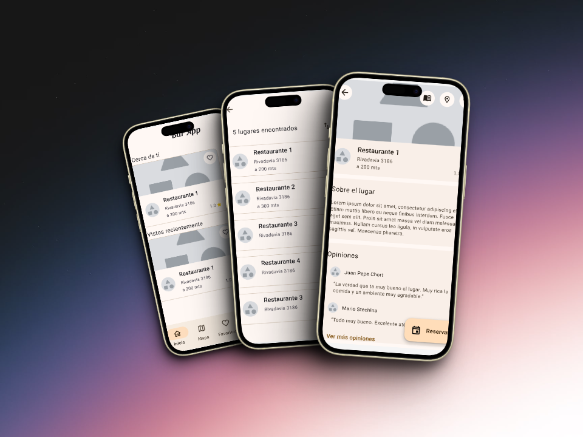
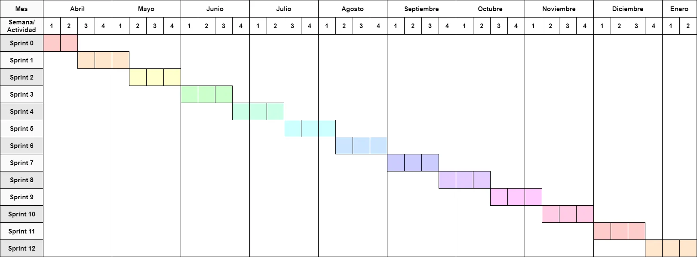

 
    

  

[Reportar error](https://github.com/BarApp-Chort-Quarin-Reynoso/BarApp-Mobile/issues) · [Ver plan de proyecto](https://docs.google.com/document/d/1dDYaoWykSRaM1nkCH1_gco9MEoXOnQTWLxpbtQdcf0A/edit?usp=sharing)

 

# BarApp - Prototipo de aplicación móvil

> PROYECTO FINAL DE CARRERA - INGENIERÍA EN SISTEMAS DE INFORMACIÓN

Este repositorio contiene el código fuente de la aplicación móvil de **BarApp**, un prototipo de una aplicación para la gestión de reservas en bares y restaurantes.

## 🎯 Objetivo general

Implementar un prototipo funcional de una plataforma única de gestión de reservas para bares de la ciudad de Santa Fe que agregue valor tanto a los locales comerciales como a sus clientes.

## 📱 Descripción

La aplicación móvil de **BarApp** es una aplicación desarrollada en **Kotlin** que permite a los usuarios realizar reservas en bares y restaurantes. La aplicación permite a los usuarios buscar establecimientos, ver la información de los mismos, ver la disponibilidad de mesas y realizar reservas para cualquier día y horario deseado.

## ⚖️ Estimación de duración del proyecto

- Duración de los _sprints_: 3 semanas
- Tiempo dedicado: 4,8 PE/semana (1 PE = 5 horas)
- Velocidad del sprint: 14,4 PE/sprint
- Duración estimada del proyecto: 38 semanas
- Cantidad de _sprints_: 13

## ⏳ Cronograma del proyecto

  

## 🛠️ Ambiente de desarrollo, tecnologías y plataformas

## 👨🏻‍💻 Alumnos

- **Chort**, Julio Alberto
- **Quarin**, Federico
- **Reynoso**, Valentín

## 📚 Directora

- **Ing. Blas**, María Julia
